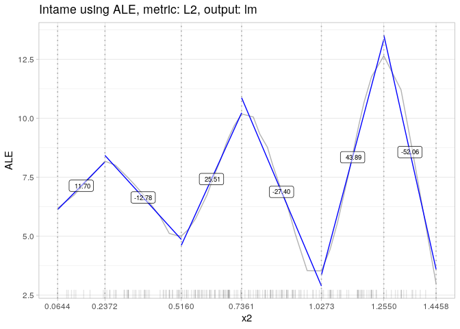

R package *intame*: Interval-based Marginal Effects
================

[](https://opensource.org/licenses/BSD-3-Clause)
[](http://cran.r-project.org/web/packages/intame)
[](http://cran.rstudio.com/web/packages/intame/index.html)

Tame your model output with INTerval-bAsed Marginal Effects.

## Installation of the package

Install the development version from GitHub (using `devtools`):

``` r
devtools::install_github("bodoburger/intame")
```

## Example

``` r
library(intame)
library(nnet)
set.seed(4219)
n = 200
x = runif(n, min = 0, max = 1)
x1 = runif(n, min=0, max=1) + .5*x
x2 = runif(n, min=0, max=1) + .5*x
y2 = function(x) -4 * cos(4*pi*x) * x + 4
y = 4*x1 + y2(x2) + rnorm(n, 0, .5)
df = data.frame(y, x1, x2)
nnet.mod = nnet(y ~ ., df, size = 20, linout = TRUE,
  decay = 0.0001, maxit = 1000, trace = FALSE)
AME.x1 = intame(nnet.mod, df, "x1")
AME.x1
```

    ## [0.007, 1.413) 
    ##       4.054118

``` r
plot(AME.x1)
```

<!-- -->

``` r
AME.x2 = intame(nnet.mod, df, "x2")
AME.x2
```

    ## [0.064, 0.237) [0.237, 0.516) [0.516, 0.736) [0.736, 1.027) [1.027, 1.255) 
    ##       11.69899      -12.78246       25.51410      -27.39529       43.89440 
    ## [1.255, 1.446] 
    ##      -52.06151

``` r
plot(AME.x2)
```

<!-- -->

## Documentation

See [Rmarkdown
files](https://github.com/BodoBurger/intame/tree/master/documentation).
