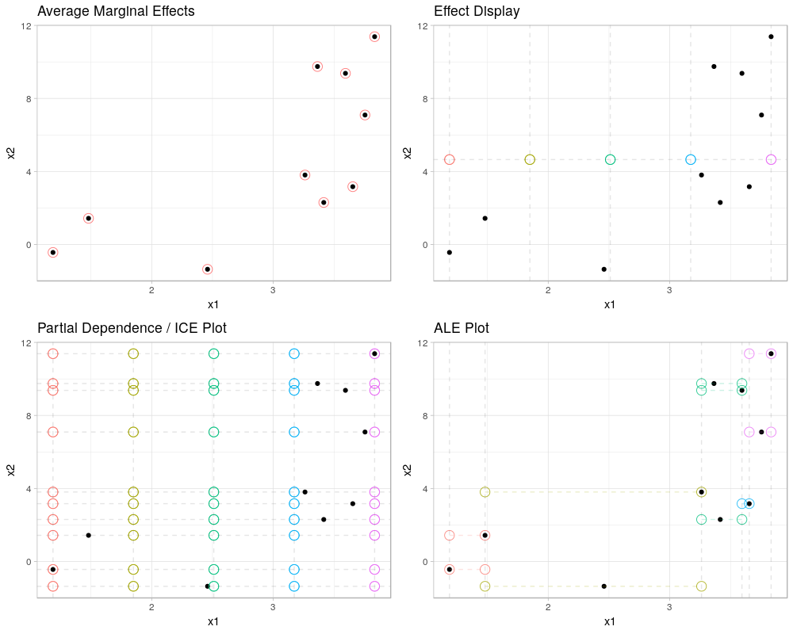

```{r setup, include = FALSE}
knitr::opts_chunk$set(collapse = TRUE, comment = "#>",
  echo = TRUE, message = FALSE, warning = TRUE,
  cache = FALSE, cache.path = "cache/introduction_to_intame/")
library("intame")
library("ggplot2")
library("mlr")
library("ame")
library("patchwork")
theme_set(theme_light())
```

## Motivation


## Data generating process

### Perfectly Separable, Moderate Correlation

```{r dgp-low-cor}
set.seed(4219)
n = 500
x = runif(n, min = 0, max = 1)
x1 = runif(n, min=0, max=1) + .5*x
x2 = runif(n, min=0, max=1) + .5*x
y2 = function(x) -4 * cos(4*pi*x) * x + 4
y = 4*x1 + y2(x2) + rnorm(n, 0, .5)
df = data.frame(y, x1, x2)
knitr::kable(head(df))
print(cor(x1, x2))
gridExtra::grid.arrange(
  qplot(x1, 4*x1, geom = "line") + ggtitle("\"True effect\" for x1"),
  qplot(x2, y2(x2), geom = "line") + ggtitle("\"True effect\" for x2"),
  ncol=2)
```

## Model - neural network

```{r fit-neural-network}
tsk = makeRegrTask(data = df, target = "y")
nnet.lrn = makeLearner("regr.nnet", skip = FALSE, size = 20, decay = 0.0001,
                       maxit = 1000, trace = FALSE)
nnet.mod = train(nnet.lrn, tsk)
```

## AME

Definition:

$$
    \text{AME}_j = \frac{1}{n} \sum_{i=1}^{n} f_j(\mathbf{X}, \mathbf{\theta})
$$

```{r}
computeAME(nnet.mod, df, c("x1", "x2"))
```

AME for feature 1 corresponds to the "true" effect.
For feature 2, AME is less meaningful because of the non-monotonic effect.



## Comparison of ALE and PDeriv

### Feature 1

```{r feature-1}
ALE.x1 = computeFE(nnet.mod, df, "x1", grid_size = 30)
plot(ALE.x1)
mean(ALE.x1$fe_f)
PD.x1 = computeFE(nnet.mod, df, "x1", fe_method = "PD", grid_size = 30, grid_method = "quantile")
plot(PD.x1)
mean(PD.x1$fe_f)
```

Average of ALE nearly 4, while average of PDeriv slighty more off.
Does this indicate ALE is better at representing the marginal effect?

### Feature 2

```{r feature-2}
ALE.x2 = computeFE(nnet.mod, df, "x2", grid_size = 30)
plot(ALE.x2)
PD.x2 = computeFE(nnet.mod, df, "x2", fe_method = "PD", grid_size = 30, grid_method = "quantile")
plot(PD.x2)
# analytical derivation of the additive part of feature 2:
y2_partial = function(x) 4 * sin(4*pi*x) * 4*pi * x - 4 * cos(4*pi*x)
mean(y2_partial(x2))
mean(ALE.x2$fe_f)
mean(PD.x2$fe_f)
computeAME(nnet.mod, df, "x2")$x2
```

"True" effect is assumed to be the average of the partial derivative.
Only valid for independent features?!?

PDeriv is slightly "better" than ALE.
AME is similar to "true" effect.

## Find intervals of similar MEs

### Feature 2

```{r, fig.cap="Green: breaks based on PD. Blue: ALE."}
breaks.ALE = partition(ALE.x2$fe_x, ALE.x2$fe_f, 5)
breaks.PD = partition(PD.x2$fe_x, PD.x2$fe_f, 5)
plot(ALE.x2) +
  geom_vline(xintercept = breaks.PD, col = "green") +
  geom_vline(xintercept = breaks.ALE, col = "blue")

```

rpart returns reasonable intervals.

```{r fig.cap="Green: breaks based on PD. Blue: ALE."}
breaks.ALE.cluster = partition(ALE.x2$fe_x, ALE.x2$fe_f, 5, part_method = "cluster")
breaks.PD.cluster = partition(PD.x2$fe_x, PD.x2$fe_f, 5,  part_method = "cluster")
plot(ALE.x2) +
  geom_vline(xintercept = breaks.PD.cluster, col = "green") +
  geom_vline(xintercept = breaks.ALE.cluster, col = "blue")
```

 Clustering does not work here.

#### Compute AME given the intervals

```{r}
AME.x2 = intame(nnet.mod$learner.model, df, "x2", x_splits = breaks.ALE,
  use_iter_algo = FALSE, output_method = "AME")
AME.x2
plot(AME.x2)
```

We check the result by calculating the "true" effect in each interval
using the analytically calculated partial derivative.

```{r}
bounds = unique(c(min(x2), sort(breaks.ALE), max(x2) + 0.00001))
l = length(bounds) - 1
true.effects = numeric(l)
for (i in 1:l) {
  selection = x2 >= bounds[i] & x2 < bounds[i+1]
  df.interval = df[selection,]
  true.effects[i] = mean(y2_partial(x2[selection]))
}
AME.x2
true.effects
```

Checks out.

#### Add break point "manually"

An additional break point at around .25 might be sensible. We add it and calculate
AMEs for each interval again.

```{r}
AME.x2.add.break.point = intame(nnet.mod, df, "x2",
  x_splits = c(0.25, breaks.PD),
  use_iter_algo = FALSE, output_method = "AME")
AME.x2.add.break.point$AME
plot(AME.x2.add.break.point)
```

#### Fully automatic

*intame* calculates breaks points by default:

```{r}
AME.x2.auto = intame(nnet.mod, df, "x2", fe_method = "ALE",
  use_iter_algo = FALSE, output_method = "AME")
AME.x2.auto
plot(AME.x2.auto)
AME.x2.auto$bounds
```

#### Local PDeriv

```{r}
AME.x2.LPD = intame(nnet.mod, df, "x2",
                       fe_method = "PD", l = 40)
plot(intame(nnet.mod, df, "x2", fe_method = "PD"))
plot(AME.x2.LDeriv) + ggtitle("Local Partial Derivative, l = 40")
```

No difference to PDeriv.

#### Weighted PDeriv

```{r}
AME.x2.WDeriv = intame(nnet.mod$learner.model, df, "x2",
                                method = "PDeriv", w = 4)
plot(AME.x2.WDeriv) + ggtitle("Weighted Partial Derivative, w = 4")
```

No difference to PDeriv.

<!-- ### Perfectly Separable, High Correlation -->

<!-- Regression example with two highly correlated features. -->

<!-- ```{r dgp-hi-cor} -->
<!-- set.seed(4321) -->
<!-- n = 500 -->
<!-- x = runif(n, min = 0, max = 1) -->
<!-- x1 = x + rnorm(n, 0, 0.05) -->
<!-- x2 = x + rnorm(n, 0, 0.05) -->
<!-- y2 = function(x) -4 * cos(4*pi*x) * x + 4 -->
<!-- y = x1 + y2(x2) + rnorm(n, 0, .5) -->
<!-- df = data.frame(y, x1, x2) -->
<!-- knitr::kable(head(df)) -->
<!-- print(cor(x1, x2)) -->
<!-- ``` -->

## More features

```{r}
set.seed(4218)
normalize = function(x, lower.bound = 0, upper.bound = 1) {
  x.min = min(x)
  c1 = (upper.bound - lower.bound)/(max(x) - x.min)
  c2 = lower.bound - c1 * x.min
  return(c1 * x + c2)
}
n = 2000
x = runif(n, min = 0, max = 1)
x1 = x + rnorm(n, 0, 0.05)
x2 = x + rnorm(n, 0, 0.05)
x3 = normalize(0.9 * x + rnorm(n, 0, .1))
x4 = .85 * x + rnorm(n, 0, .1)
x5 = normalize(0.5 * x + rnorm(n, 0, .1))
x6 = rnorm(n)
x7 = runif(n, 0, 1)
y1 = function(x) x
y2 = function(x) 10*(x-.25)^2
y3 = function(x) -2 * x
y4 = function(x) 40 * ((x-.2)^3 - (x-.2)^2) + 4
y5 = function(x) -4 * cos(4*pi*x) * x + 4
y6 = function(x) .1 * x
y7 = function(x) x^2
x.grid = seq(0, 1, .01)
par(mfrow = c(2,3), oma = c(0, 0, 2, 0))
plot(x.grid, y2(x.grid), type = "l", xlab = "x2")
plot(x.grid, y3(x.grid), type = "l", xlab = "x3")
plot(x.grid, y4(x.grid), type = "l", xlab = "x4")
plot(x.grid, y5(x.grid), type = "l", xlab = "x5")
plot(x.grid, y6(x.grid), type = "l", xlab = "x6", ylim = c(0,1))
plot(x.grid, y7(x.grid), type = "l", xlab = "x7")
mtext("True partial effects", outer = TRUE, cex = 1.5)
par(mfrow = c(1,1))
y = y1(x1) + y2(x2) + y3(x3) + y4(x4) + y5(x5) + y6(x6) + y7(x7) + rnorm(n, 0, 1)
dt = data.frame(y, x1, x2, x3, x4, x5, x6, x7)
knitr::kable(cor(dt)[,-1])
```

### Fitting

```{r}
train.ind = c(rep(TRUE, 1000), rep(FALSE, 1000))
tsk = makeRegrTask(data = dt, target = "y")
lm.lrn = makeLearner("regr.lm")
lm.mod = train(lm.lrn, tsk, subset = train.ind)
summary(lm.mod$learner.model)
nnet.lrn = makeLearner("regr.nnet", skip = FALSE, size = 20, decay = 0.0001,
  maxit = 1000, trace = FALSE)
nnet.mod = train(nnet.lrn, tsk, subset = train.ind)
svm.lrn = makeLearner("regr.svm")
svm.mod = train(svm.lrn, tsk, subset = train.ind)
ntrees = 10000
gbm.lrn = makeLearner("regr.gbm", n.trees = ntrees, interaction.depth = 1, shrinkage = .02)
gbm.mod = train(gbm.lrn, tsk, subset = train.ind)
```

### Performance

```{r}
lm.pred = predict(lm.mod, tsk, subset = !train.ind)
nnet.pred = predict(nnet.mod, tsk, subset = !train.ind)
svm.pred = predict(svm.mod, tsk, subset = !train.ind)
gbm.pred = predict(gbm.mod, tsk, subset = !train.ind)
performance(lm.pred, list(mse, rsq))
performance(nnet.pred, list(mse, rsq))
performance(svm.pred, list(mse, rsq))
performance(gbm.pred, list(mse, rsq))
```

### intame

#### Feature x2

```{r}
plot(computeFE(lm.mod, data = dt, "x2"))
plot(computeFE(nnet.mod, data = dt, "x2"))
plot(computeFE(svm.mod, data = dt, "x2"))
plot(computeFE(gbm.mod, data = dt, "x2"))
```

```{r}
plot(computeFE(lm.mod, data = dt, "x2", fe_method = "PD"))
plot(computeFE(nnet.mod, data = dt, "x2", fe_method = "PD"))
plot(computeFE(svm.mod, data = dt, "x2", fe_method = "PD"))
plot(computeFE(gbm.mod, data = dt, "x2", fe_method = "PD"))
```


```{r}
intame(lm.mod$learner.model, data = dt, "x2")
intame(nnet.mod$learner.model, data = dt, "x2")
intame(svm.mod$learner.model, data = dt[train.ind,], "x2")
intame(gbm.mod$learner.model, data = dt[train.ind,], "x2",
  predict_fun = function(object, newdata) predict(object, newdata, n.trees = ntrees))
```

#### Feature x5

```{r}
plot(computeALE(lm.mod$learner.model, data = dt, "x5"))
plot(computeALE(nnet.mod$learner.model, data = dt, "x5"))
plot(computeALE(svm.mod$learner.model, data = dt, "x5"))
plot(computeALE(gbm.mod$learner.model, data = dt, "x5",
  predict_fun = function(object, newdata) predict(object, newdata, n.trees = ntrees)))
```

```{r}
plot(computePD(lm.mod$learner.model, data = dt, "x5"))
plot(computePD(nnet.mod$learner.model, data = dt, "x5"))
plot(computePD(svm.mod$learner.model, data = dt, "x5"))
plot(computePD(gbm.mod$learner.model, data = dt, "x5",
  predict_fun = function(object, newdata) predict(object, newdata, n.trees = ntrees)))
```


```{r}
intame(lm.mod$learner.model, data = dt, "x5")
intame(nnet.mod$learner.model, data = dt, "x5")
intame(svm.mod$learner.model, data = dt[train.ind,], "x5")
AME.x5.gbm = intame(gbm.mod$learner.model, data = dt[train.ind,], "x5",
  predict_fun = function(object, newdata) predict(object, newdata, n.trees = ntrees))
plot(AME.x5.gbm)
```
